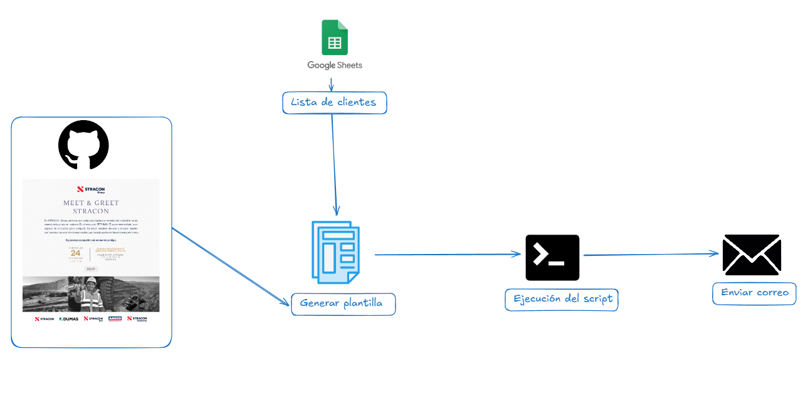

#### Preview



#### Ejecución del script

```bash
GOOGLE_SHEET_ID='Id de la hoja de google Sheets'
GOOGLE_SHEETS_CREDENTIALS='Credencial de GCP'
OUTLOOK_PASSWORD='Contraseña del correo electrónico de outlook'
OUTLOOK_USER='correo electrónico de outloock'
```

```bash
npm start
```
